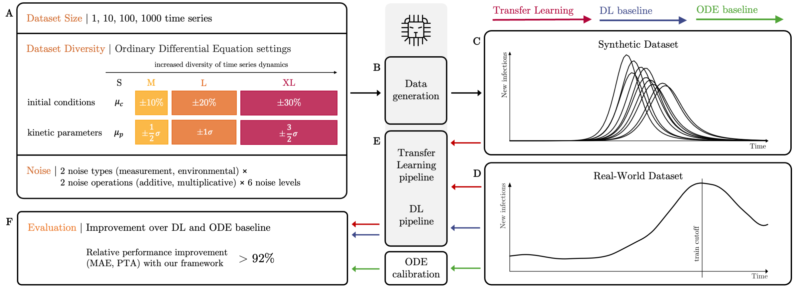

# Optimizing ODE-derived Synthetic Data for Transfer Learning in Dynamical Biological Systems

This code repository provides the necessary tools to reproduce the findings from Zabbarov & Witzke et al., 2024, on optimizing synthetic dataset characteristics for a simulation-based transfer learning approach to predicting dynamical biological systems.



## Installation

To run the code, please set up a new environment with Python 3.10 or later and install the required dependencies, i.e. using pip:
```
pip install -r dev_requirements.txt
```
Please call each script from the root directory of this repository.

## Structure of Repository

- Datasets: The datasets for the rotifers-algae, lynx-hares and COVID-19 experiments are provided in `/src/data`. Here, we also provide the scripts for generating synthetic datasets from the calibrated ODE models. For further details, see the README.mds in the respective folders.
- Transfer Learning and Deep Learning Experiments: The code to run and evaluate the transfer learning and deep learning experiments for each biological system is contained in `/src/experiments/julian`. The folder has the following structure:
    - algae-rotifers (coherent) w/ small DL model architecture: `/algae-rotifers/run-1`
    - algae-rotifers (coherent) w/ large DL model architecture: `/algae-rotifers/run-4`
    - algae-rotifers (incoherent) w/ small DL model architecture: `/algae-rotifers/run-5`
    - algae-rotifers (incoherent) w/ large DL model architecture: `/algae-rotifers/run-8`
    - COVID-19 w/ small DL model architecture: `/algae-rotifers/run-1`
    - COVID-19 w/ large DL model architecture: `/algae-rotifers/run-6`
    - lynx-hares w/ small DL model architecture: `/algae-rotifers/run-10`
    - lynx-hares w/ large DL model architecture: `/algae-rotifers/run-18`
    - `evaluation.ipynb` notebook provides the code used to evaluate the experiments. The results from the experiments are loaded from the `/results` folder.
    - You can use the `preprocessing_results...` notebooks to preprocess the results after running the experiments again. 
- DL models: The small and large architecture DL models are defined as plugins for SimbaML in `/src/models`.
- Custom Metrics: You can define custom evaluation metrics in the `/src/metrics` folder.
- ODE calibration: The code used to calibrate the ODEs for each each biological system is contained in `/src/experiments/simon`.
- Plotting Function: The scripts used to generate the plots in the paper are provided in `/plotting`.

## Walkthrough

In the following, we provide details on how to run the scripts in this repo. Call each script from the root directory of this repository.

### 1. Generation of ODE-derived Synthetic Datasets

For each of the experiments, we provide a Python script to generate synthetic datasets from the respective ODE models.
You can start the data generation process by calling the following files in the `/data`-folder:

Data Generation with SIR model for COVID-19 experiments:
```
python src/data/covid/sir.py
```

Data Generation with SAR model for rotifers-algae experiments:
```
python src/data/algae-rotifers/rosenbaum.py
```

Data Generation with LV model for lynx-hares experiments:
```
python src/data/lynx-hares/lotka_volterra.py
```

Details on the sampling intervals for initial conditions and kinetic parameters used to generate the data are also listed in the mentioned scripts.

### 2. Time Series Prediction

#### 2.1 Setup Experiments

To set up the time series prediction experiments, call the `setup_experiment.sh` scripts in each of the `experiments/julian` folders. In the following, we follow as an example the experiments on the COVID-19 experiments using the small DL model architectures.
```
src/experiments/julian/covid/run-1/setup_experiment.sh
```

##### Transfer Learning
Running the shell script will generate the required toml-files for configuring the transfer learning pipeline of SimbaML. You will find a folder and toml-file for each synthetic dataset (listed in `src/data/<experiment>/synthetic`) in a `runs_transfer_learning`-folder in the same location as the `setup_experiment.sh`.  You can adjust the time series prediction in the `generate_tomls_transfer_learning.py`file. Additionally, a shell script (`run_multivariate.sh`) will be generated with which you can schedule the transfer learning run for each synthetic dataset at once.

##### DL Baseline
Running the `setup_experiment.sh` will also generate toml-files to start the DL baseline. You will find five experiment-folder (one for each seed) in the `/runs_baseline`-folder in the same location as the `setup_experiment.sh`.

#### 2.2 Run Experiments

Before running experiments, add the absolute path of the `src`-folder of this repository to PYTHONPATH:
```
export PYTHONPATH="{PYTHONPATH}:<path_to_repository>/opt-synthdata-4tl/src"
```

You can start the transfer learning and DL experiments like so:
```
sh src/experiments/julian/covid/run-1/run_baseline.sh
sh src/experiments/julian/covid/run-1/run_multivariate.sh
```

You find the prediction results for the deep learning and transfer learning experiments in the `/runs_baseline` and `run_transfer_learning` folder, respectively. Note that you might have to adjust PyTorch Lightning's internal `num_worker` depending on the architecture on which the experiments are executed to speed up the training process.

### Citation
If you use our pipeline from this repository and its code, please cite our preprint Zabbarov & Witzke et al., 2024:

Julian Zabbarov, Simon Witzke, Maximilian Kleissl, Pascal Iversen, Bernhard Y. Renard, Katharina Baum
Optimizing ODE-derived Synthetic Data for Transfer Learning in Dynamical Biological Systems
bioRxiv 2024.03.25.586390; doi: https://doi.org/10.1101/2024.03.25.586390 

